# ZoomInZoomOut

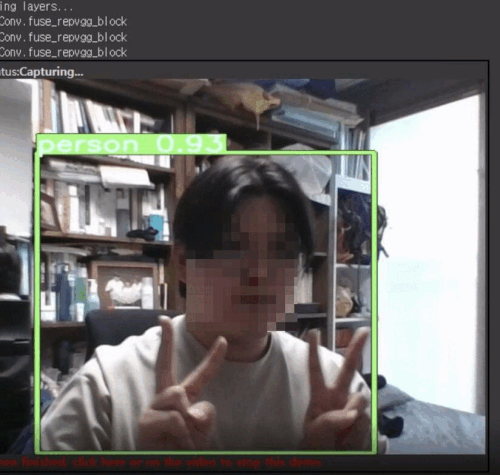

# 1. 프로젝트 개요
프로젝트 기간 : 22.12.22- 22.01.05 (2주)

팀 구성 : AI 부트캠프 파이널프로젝트 팀 5인 (노나은, 문병욱, 문영운, 박혜민, 조혜인)

기관 : 멋쟁이사자처럼

 

# 2. 프로젝트 목표
온라인 화상 수업에서 수강생이 자리를 비울 경우를 탐지하는 모델을 구현합니다. 자리에 있는지 여부를 파악하여 메세지를 출력하고, 기록합니다.

 

# 3. 모델 선정 과정(MediaPipe, OpenCV, Face Recognition, YOLOv3-5-7)
## 3-1. MediaPipe
> **MediaPipe**는 6개의 랜드마크(오른쪽 눈, 왼쪽 눈, 코 끝, 입 중심, 오른쪽 귀, 왼쪽 귀) 및 다중 얼굴 지원과 함께 제공되는 초고속 얼굴 감지 솔루션.
>
>**min_detection_confidence**의 기본값은 0.5이며, 0.0~1.0 사이의 값으로 모델의 최소 신뢰값.
>
>**model_selection**의 기본값은 0. 카메라에서 2m 이내의 얼굴에 적합한 근거리 모델일 때는 0, 5m 이내의 얼굴에 적합한 전체 범위 모델일 때는 1을 선택.

CASE 1) model_selection(모델 선택) = 0 일 때,

- 최소 감지 신뢰값(min_detection_confidence)을 0.2, 0.5, 0.8로 조정하였으나 얼굴 탐지 결과가 동일하며, 마스크 쓴 경우는 탐지 불가.
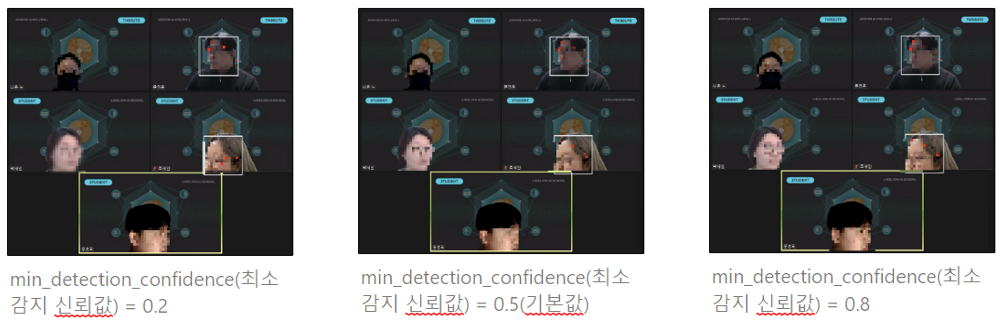

CASE 2) model_selection(모델 선택)  = 1 일 때,

- model_selection = 0 인 경우에 비해 얼굴 측면을 잘 탐지하지만, 여전히 마스크 쓴 사람은 탐지 불가.
  
  ((📌 이미지 신뢰값 0.8 => 0.5로 수정할 것))
  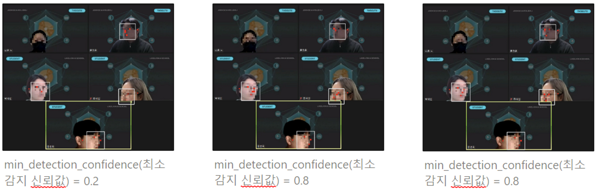

## 3-2. OpenCV
> `OpenCV`는 영상 처리에 사용할 수 있는 오픈 소스 라이브러리.
> 
> Face detection의 결과물은 **파란색 박스**
>
> Eye detection의 결과물은 **연두색 박스**로 출력

CASE 1) 5명 중 2명 탐지

- Face detection : 마스크를 쓴 사람과 얼굴 측면이 보이는 사람은 탐지 불가
- Eye detection : 얼굴 탐지한 2명 중 1명만 탐지, 입을 눈으로 잘못 탐지

CASE 2) 4명 중 1명 탐지

- Face detection : 이목구비가 다 보이는 1명만 탐지
- Eye detection : 입(술)이 가려진 상태에서는 정상적으로 탐지

CASE 3) 5명 중 3명 탐지

- Face detection : 마스크를 쓴 사람이 없는 경우, 5명 중 3명의 얼굴을 탐지
- Eye detection : 얼굴을 탐지한 3명 중, 눈을 제대로 탐지한 경우가 1건, 입을 눈으로 잘못 탐지한 경우가 1건, 눈을 아예 탐지하지 못한 경우가 1건
  
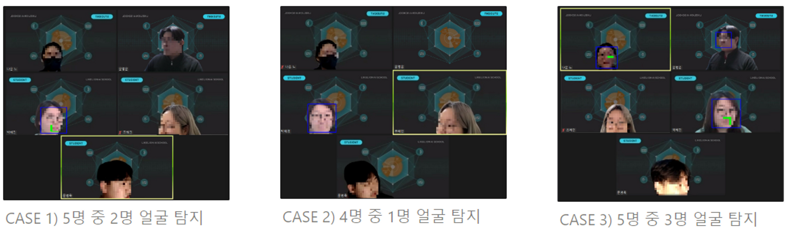

## 3-3. Face Recognition

> `Face Recognition`은 딥러닝 기반으로 제작된 dlib의 얼굴 인식 기능을 사용하여 구축.
> 
> 수강생 정면 얼굴 사진과 이름을 사전 학습 시켜야 한다는 전제 조건이 발생.
> 
> 조건을 만족하더라도 얼굴 탐지가 잘 되려면 각도가 잘 맞아야 하는 제한 사항.

CASE 1) 팀원 사진을 모두 사전 학습

- 이목구비가 잘 나온 팀원 2명은 얼굴과 라벨이 잘 맞게 탐지하는 것을 확인
- 마스크를 쓴 사람과 얼굴 측면이 보이는 경우에는 얼굴을 탐지하지 못함
  
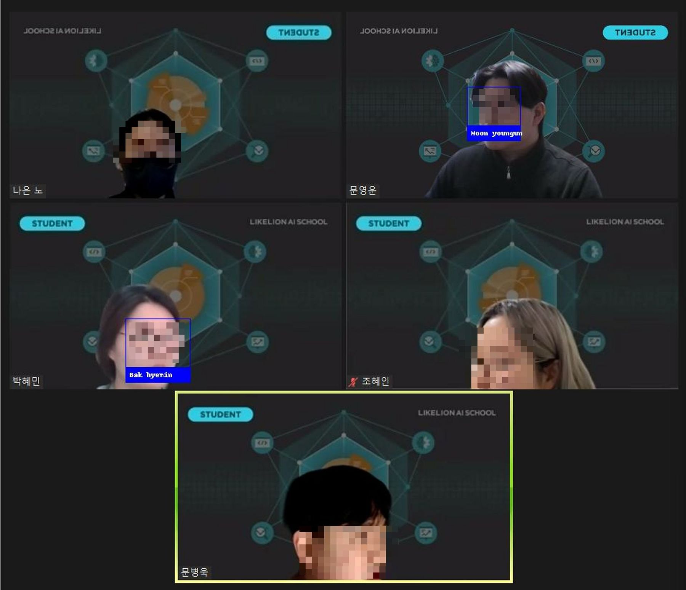

 

## 3-4. YOLOv3-5-7

YOLOv3도 인물 탐지를 5명 모두 잘 하고 있지만 YOLO 모델 별 성능 비교를 확인하면 최근 버전이 더 나은 성능을 보여주는 것을 확인하고, YOLOv5와 YOLOv7 테스트 진행

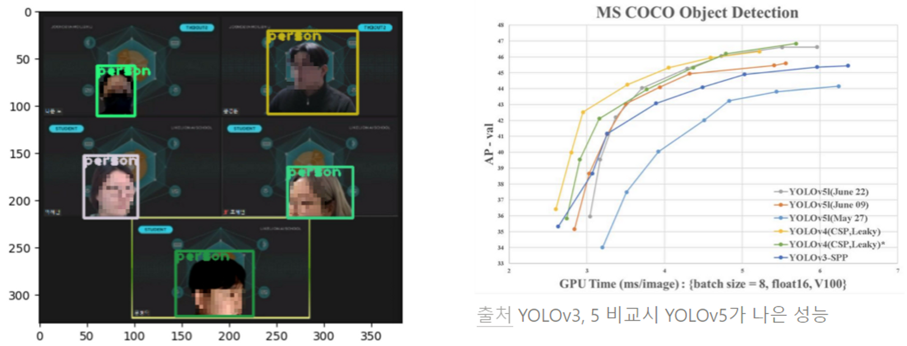

YOLOv5의 confidence 점수 평균은 0.736, YOLOv7의 confidence 점수 평균은 0.808로 높은 점수를 보여주기 때문에 📌**YOLOv7을 선택**.
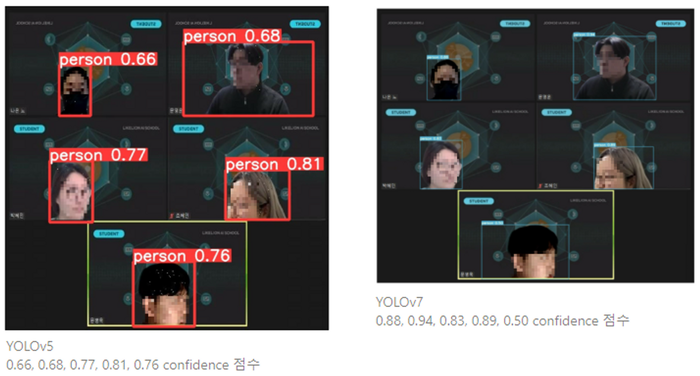

또한, YOLOv7에서 파스칼 데이터셋을 활용해 사람만 예측하도록 후처리를 해준 경우, 사람을 인지하지 못한 경우가 존재하고 가장 높은 confidence 점수가 0.67점임을 확인하여 📌**YOLOv7의 코코 데이터셋을 활용하기로 결정**.

yolo코코,파스칼.png)

# 4. YOLOv7 모델 후처리

## 4-1. 1차 후처리(사람 외 이동수단 인식 제거)

가중치를 높여 보았을 때 해결이 되지 않아서, 라벨을 읽어올 때부터 사람만 한정하는 코드를 추가해서 이동수단을 인식하는 경우를 제거
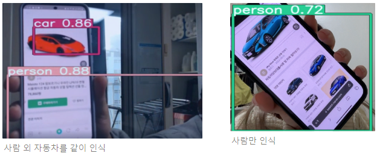

## 4-2. 2차 후처리(사람을 인식하는 여러 개의 box 문제)

사람은 한 명인데 너무 많이 인식하는 경우, 일정 confidence 값 이하로는 시각화하지 않도록 설정하여 해결
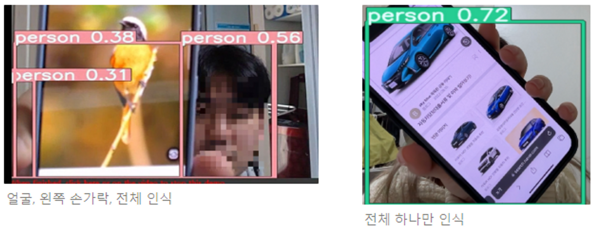

# 5. 결과물(자리 비움 탐지)

1. 웹캠 실행, 인물 탐지 시작
   
   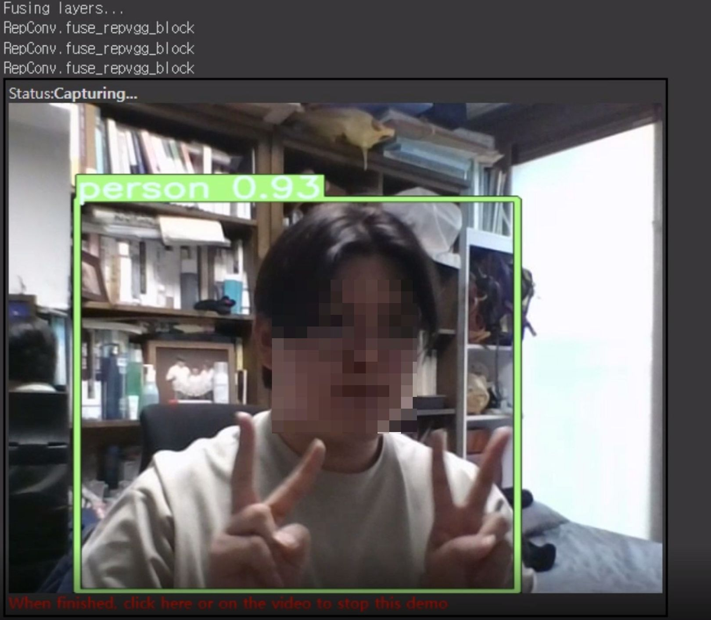
2. 인물이 웹캠 화면을 이탈, 지속해서 자리에 없다면 '자리 비움' 로그 생성
   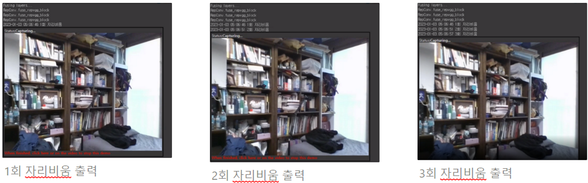
3. 인물이 다시 웹캠 화면 상에 탐지(25초경)
   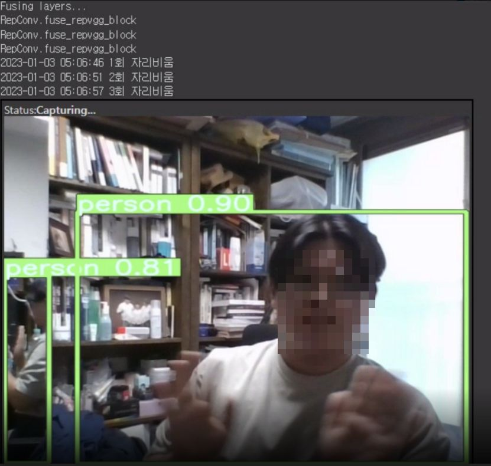
4. 잠시 등장했다가 화면 상에서 사라지면(31초), 그 기준으로 다시 자리 비움 여부를 체크(44초경 1회 자리 비움 메시지 출력)
   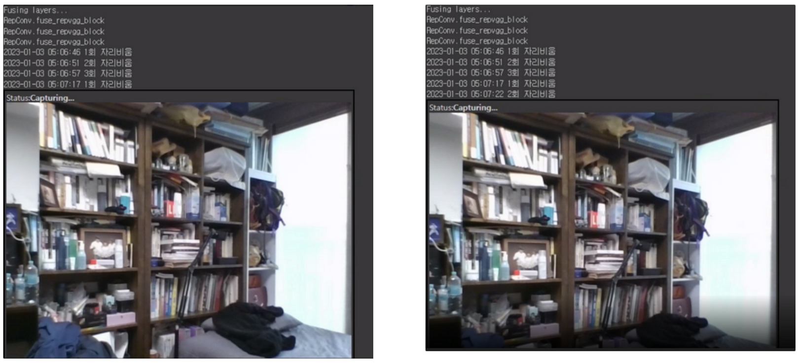

# 6. Edge Case
## 6-1. 거울에 비친 사람 인식
거울에 비친 경우는 실체보다 낮은 점수지만 사람이라고 판단하여 감지
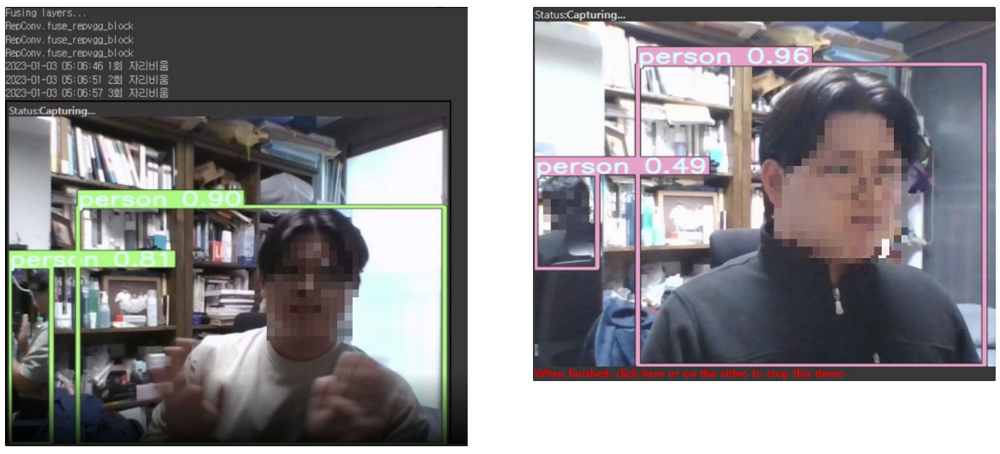

## 6-2. 인형, 그림, 사진을 사람으로 인식
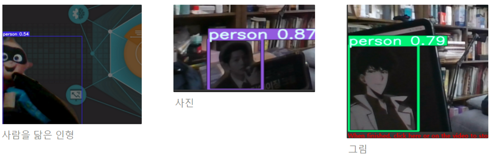